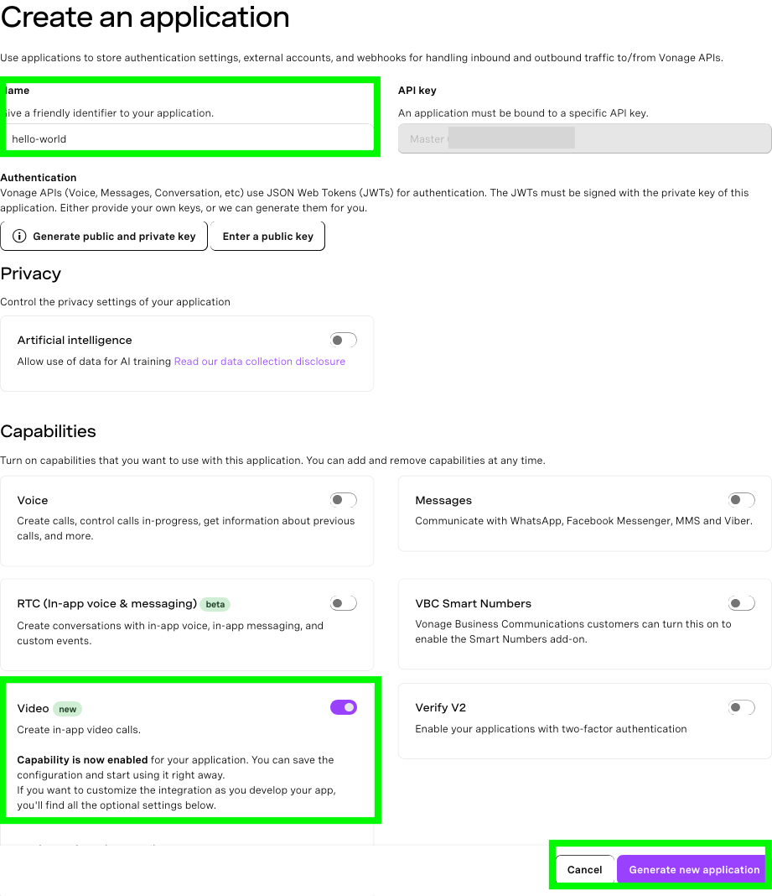
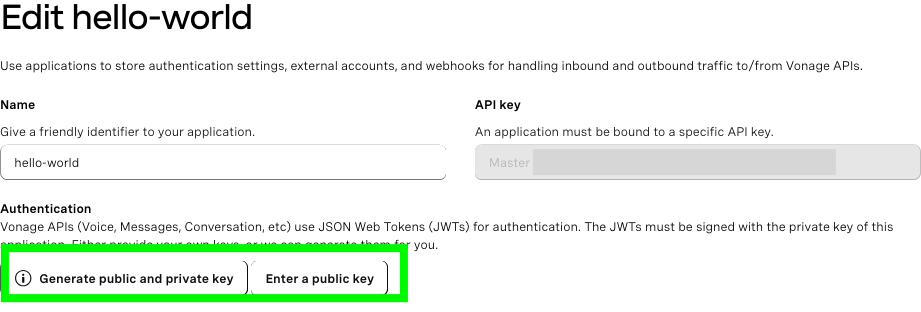
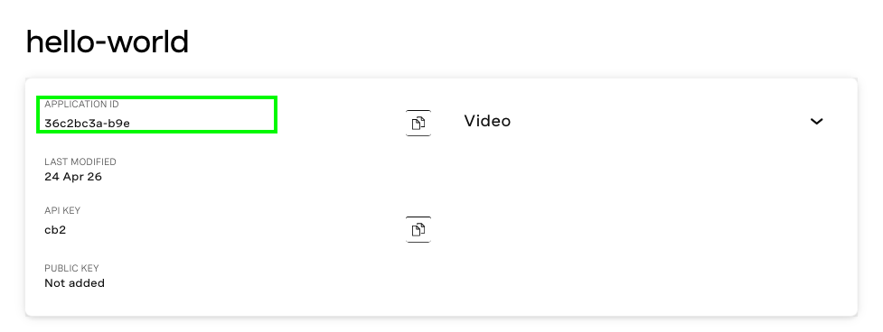
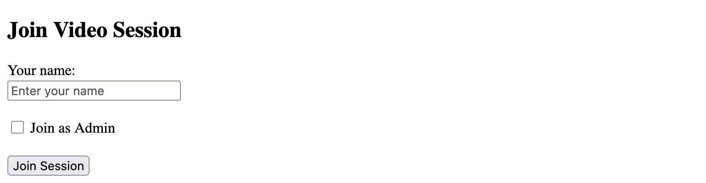
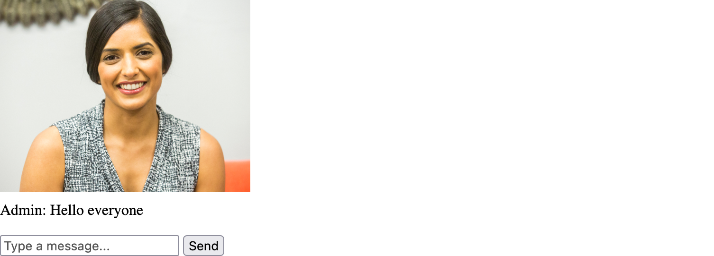

# Video Conferencing Web App With Flask and Vonage

A minimal real-time video chat application built with Flask and the [Vonage Video API](https://vonage.dev/4txlo1b). Users can join as either an admin who broadcasts video or as a participant who receives video streams, and can communicate via an integrated chat feature.

## Features

- **Video Sessions**: Create and join video sessions using Vonage Video API
- **Admin/Participant Roles**: Admins publish their video stream while participants subscribe to streams
- **Real-time Chat**: Participants can send and receive text messages during video sessions using Vonage signal events

# How To Get This Code Running

## Prerequisites
- Python 3.8+
- A [Vonage API account](https://vonage.dev/4dtSoCc)
- An [ngrok account and installation](https://vonage.dev/4d9waov)

## Setup

### 1. Create a Vonage account

You will need a [Vonage API account](https://vonage.dev/4dtSoCc) -- it's free to sign up!

### 2. Create a Video application

Create your Video application in the [developer dashboard](https://dashboard.vonage.com/applications) by navigating to the **Applications** window from the left hand menu and clicking the “Create new application” button. This will open the application creation menu. Give your application a human-friendly name like `vonage-hello-world`.

Under the **Capabilities** section, toggle the option for **Video**.

Click the “Generate new application” button.



### 3. Create an account with ngrok and install it
The Voice API must be able to access your webhook so that it can make requests to it, therefore, the endpoint URL must be accessible over the public internet.

In order to do that for this tutorial, we will use [ngrok](https://ngrok.com/). Check out our [ngrok tutorial](https://vonage.dev/4d9waov) to learn how to install and use it.

### 4. Spin up an ngrok tunnel

In a separate terminal window, run:

```
ngrok http 5000
```

This command will generate the public URLs your local server will tunnel to on port 3000. Take note of the public URL – it should look something like this:

```bash
Forwarding                	https://some-public-url.ngrok-free.app -> http://localhost:5000
```

## Run the code

### 1. Create and activate a Python virtual environment

```
virtuanlenv venv && source venv/bin/activate
```
### 2. Install dependencies
```
pip install -r requirements.txt
```
### 3. Obtain your Vonage secrets

In the developer dashboard [Applications menu](https://dashboard.vonage.com/applications), click on your application and then click **Edit**. Once the edit window opens, click on the button that says, “Generate public and private key”. This will trigger a download of your private key as a file with the extension `.key`. **Keep this file private and do not share it anywhere it could be compromised.**

Click on the "Save changes button" and also note your Application ID.





### 4. Configure your environment variables

Move your private key file to your project directory and configure the variables in the `.env_template` file accordingly:

| Variable name           | Variable value                                                                              |
|-------------------------|---------------------------------------------------------------------------------------------|
| VONAGE_APPLICATION_ID   | This is the Vonage-generated ID of the Voice application you created for this sample code   |
| VONAGE_PRIVATE_KEY_PATH | This is the path to the **private.key** file you downloaded from the developer dashboard    |

Then update the name of the file from `.env_template` to `.env`.

### 5. Run the app

To spin up the app, run the following:

`python app.py`

### 6. Try it out!

In your browser, navigate to the public URL generated by ngrok. You should see a webpage inviting you to "Join Video Session" with a text field for your name. If you want to publish a video stream, make sure to tick the box for **Join as Admin** and then click **Join Session**.



You should be redirected to a page that displays your device’s video feed. **Note**: You may have to give permission for your camera and microphone first.



With this video feed established, send the same ngrok URL to a friend and have them join _without_ selecting the option to **Join as Admin**. This will add them to the session as a subscriber so they will only be able to see the video from the Admin’s camera.

The chat feature works for all participants. When you enter text in the field and click **Send**, the text will be visible for all participants.

## References

- [A Comprehensive Guide on Working with Python Virtual Environments](https://vonage.dev/42D6eeT)
- [Vonage Video API for Developers](https://vonage.dev/4txlo1b)
- [Vonage Video API key terms](https://vonage.dev/498HP4z)
- [Signaling in the Video API](https://vonage.dev/42EWDnT)
